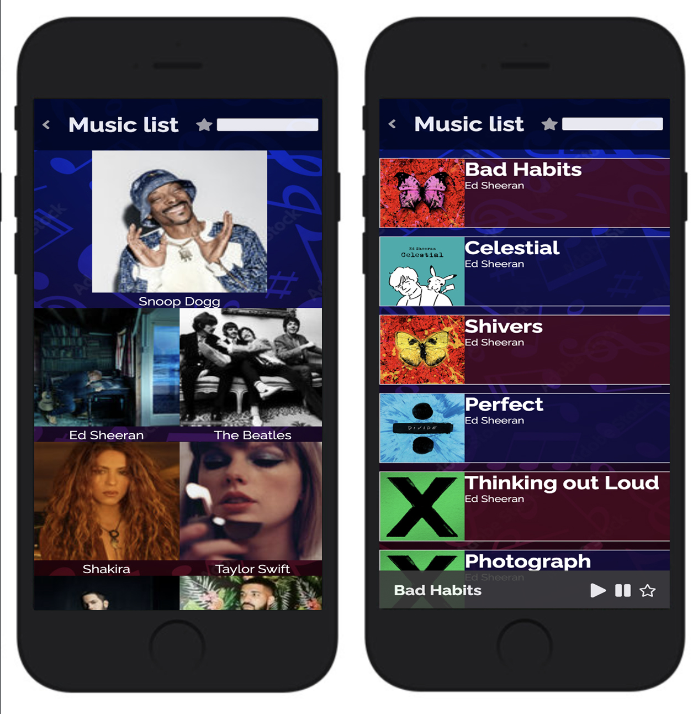

# Musify_React-Capstone

# 📗Table of Contents

- [📖 About the Project](#about-project)
- [🛠 Built With](#built-with)
- [Tech Stack](#tech-stack)
- [Key Features](#key-features)
- [🚀 Live Demo](#live-demo)
- [💻 Getting Started](#getting-started)
  - [Prerequisites](#prerequisites)
  - [Setup](#setup)
  - [Usage](#usage)
- [👥 Authors](#authors)
- [👥 Future Features](#future-features)
- [🤝 Contributing](#contributing)
- [🙏 Acknowledgements](#acknowledgements)
- [📝 License](#license)

<!-- PROJECT DESCRIPTION -->

# 📖 [Musify_React-Capstone] 

**[Musify_React-Capstone]**  Musify app is a platform that allows users to listen to music, create playlists, discover new music, and customize their listening experience. The app typically offers a vast library of songs from different genres, artists, and albums, and uses algorithms to curate personalized playlists and recommendations for users based on their listening habits. Some music apps may also offer additional features like lyrics, music videos, podcasts, and live streaming. The aim of a music app is to provide users with a seamless and enjoyable listening experience that caters to their music preferences.

> Here's a [video](https://www.loom.com/share/bc8b48aa938e4722a64d01218ffff76b) of me giving a few description of the project.

## 🛠 Built With 

### Tech Stack 

  
Client

  <ul>
    <li>HTML</li>
    <li>CSS</li>
    <li>JavaScript</li>
    <li>React</li>
    <li>Redux</li>
  </ul>

### Key Features 

- An HTML File
- A CSS File
- A Javascript file
- React
- Redux
- A modules file
- An md file

(<a href="#readme-top">back to top</a>)

<!-- LIVE DEMO -->

## 🚀 Live Demo 

> [Live Demo Link]()

(<a href="#readme-top">back to top</a>)

## 💻 Getting Started 

### Prerequisites

In order to run this project you need:

A Browser

### Setup

Clone this repository to your desired folder:

`https://github.com/Ouail-01/Musify_React-Capstone.git`

### Install

Install this project with:
A commandline interface e.g Gitbash

### Usage

To run the project, execute the following command:
`npm install`
`npm start`

To run the project, execute the following command:
Open the html file in the dist folder.

(<a href="#readme-top">back to top</a>)

## 👥 Author 

👤 **Ouail Laarabi**

- GitHub: [@Ouail-01](https://github.com/Ouail-01?tab=overview&from=2023-01-01&to=2023-01-02)
- Twitter: [@Ouail_laarabi](https://twitter.com/Ouail_Laarabi)
- LinkedIn: [Ouail Laarabi](https://www.linkedin.com/in/ouail-laarabi-53203b250/)

(<a href="#readme-top">back to top</a>)

### Future Features 

**In future features, I intend to include more pages such as:**

- Create a collection that keeps a list of books.
- Add a functionality that allows users to add and remove books to and from the collection.
- Display all saved books in the collection on the page

(<a href="#readme-top">back to top</a>)

🤝 Contributing
Contributions, issues, and feature requests are welcome!

(<a href="#readme-top"><a href="#readme-top">back to top</a></a>)

## ⭐️ Show your support 

Give a ⭐️ if you like this project!

(<a href="#readme-top">back to top</a>)

## 🙏 Acknowledgments 

I would like to thank the whole Microverse community for their help and contributions towards this project and also to the original designer Nelson Sakwa on Behance for such a wonderful design.

(<a href="#readme-top">back to top</a>)

## 📝 License

This project is [MIT](./LICENSE) licensed.